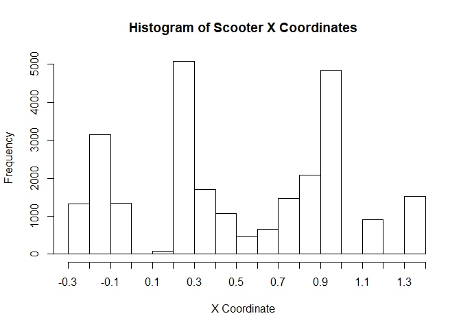
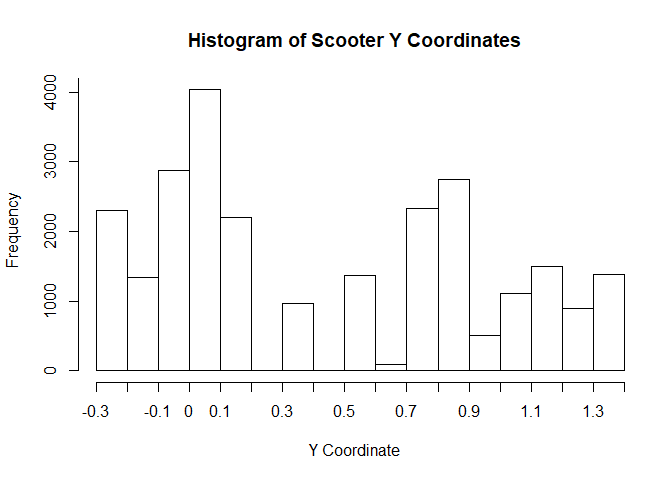
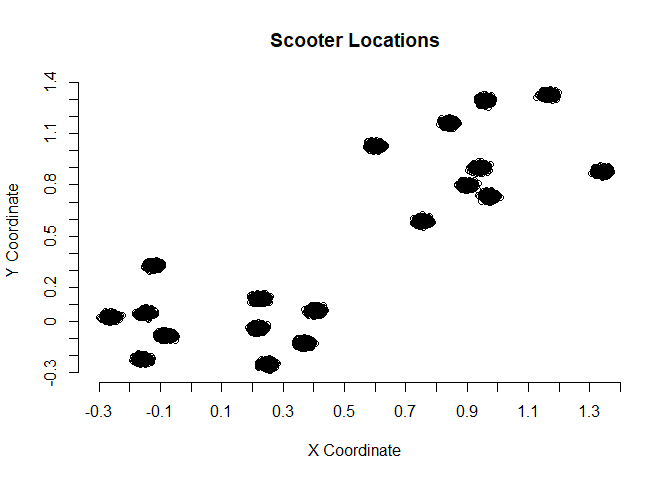
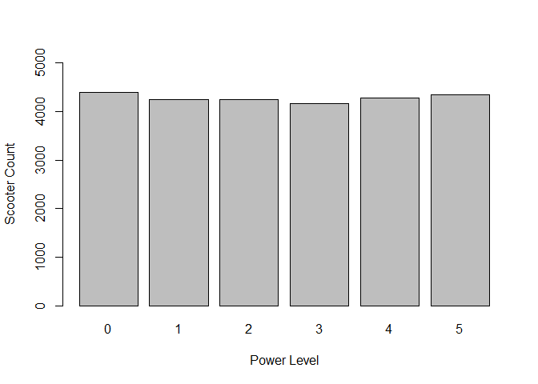
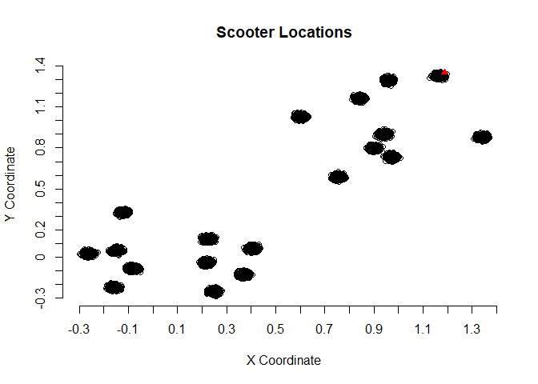
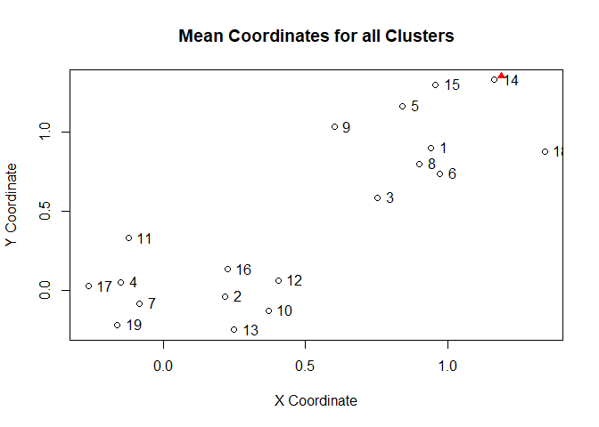

Scooter Analysis
================

``` r
Scooters <- read.csv("D:/Docs/Downloads/2019XTern_scooters.csv", header = TRUE)
summary(Scooters)
```

    ##    scooter_id     xcoordinate       ycoordinate        power_level   
    ##  Min.   :    0   Min.   :-0.3001   Min.   :-0.29020   Min.   :0.000  
    ##  1st Qu.: 6417   1st Qu.: 0.2114   1st Qu.:-0.02558   1st Qu.:1.000  
    ##  Median :12834   Median : 0.4031   Median : 0.31289   Median :2.000  
    ##  Mean   :12834   Mean   : 0.4916   Mean   : 0.43708   Mean   :2.496  
    ##  3rd Qu.:19250   3rd Qu.: 0.9292   3rd Qu.: 0.88351   3rd Qu.:4.000  
    ##  Max.   :25667   Max.   : 1.3695   Max.   : 1.35718   Max.   :5.000

``` r
str(Scooters)
```

    ## 'data.frame':    25668 obs. of  4 variables:
    ##  $ scooter_id : int  0 1 2 3 4 5 6 7 8 9 ...
    ##  $ xcoordinate: num  0.907 0.929 0.904 0.907 0.901 ...
    ##  $ ycoordinate: num  0.776 0.805 0.784 0.804 0.782 ...
    ##  $ power_level: int  0 2 1 0 4 2 4 5 4 5 ...

To identify popular scooter locations, I graphed the distribution of x and y coordinate separately and plotted them in 2D:

``` r
label <- c("-0.3", "-0.2", "-0.1", "0", "0.1", "0.2", "0.3", "0.4", "0.5", "0.6", 
           "0.7", "0.8", "0.9", "1.0", "1.1", "1.2", "1.3", "1.4")
# limits on the x axis are based on the minimum and maximum values obtained from
#  the summary of the data
hist(Scooters$xcoordinate, xlab = "X Coordinate", xlim = c(-0.3020, 1.3710), 
     axes = FALSE, main = "Histogram of Scooter X Coordinates")
axis(1, at = seq(-0.3, 1.4, 0.1), labels = label)
axis(2, at = seq(0, 5000, 1000))
```



``` r
hist(Scooters$ycoordinate, xlab = "Y Coordinate", xlim = c(-0.29030, 1.35720), 
     axes = FALSE, main = "Histogram of Scooter Y Coordinates")
axis(1, at = seq(-0.3, 1.4, 0.1), labels = label)
axis(2, at = seq(0, 5000, 1000))
```



``` r
plot(x = Scooters$xcoordinate, y = Scooters$ycoordinate, type = "p", axes = FALSE, 
     xlab = "X Coordinate", ylab = "Y Coordinate", main = "Scooter Locations")
axis(1, at = seq(-0.3, 1.4, 0.1), labels = label)
axis(2, at = seq(-0.3, 1.4, 0.1), labels = label)
```



From these graphs, I can observe that the scooters cluster around specific locations. Looking at the histograms, some x and y coordinates are particularly popular, with the y coordinates more evenly distributed than the x's. Graphing in 2D confirms the existence of popular pairs of x and y coordinates. In the graph, coordinates belonging to the same cluster pack do closely that they look like black scribbly dots. There are a total of 19 clusters. Given the proximity of scooters of the same cluster, perhaps the mega charging bus can more efficiently charge scooters by charging scooters from the same cluster at a time. The bus could travel from its parking location to the nearest cluster and work its way through each cluster, charging scooters from one cluster before moving on to scooters in the next cluster.

Keeping these thoughts in mind, I investigated the distribution of scooter power levels to see if there was anything about it that could inspire more ideas about an efficient scooter-charging strategy. At this time I also created another column in the Scooter data frame for the number of hours it would take for each scooter to charge to full battery.

``` r
Scooters$charge_time <- as.integer(5 - Scooters$power_level)
str(Scooters)
```

    ## 'data.frame':    25668 obs. of  5 variables:
    ##  $ scooter_id : int  0 1 2 3 4 5 6 7 8 9 ...
    ##  $ xcoordinate: num  0.907 0.929 0.904 0.907 0.901 ...
    ##  $ ycoordinate: num  0.776 0.805 0.784 0.804 0.782 ...
    ##  $ power_level: int  0 2 1 0 4 2 4 5 4 5 ...
    ##  $ charge_time: int  5 3 4 5 1 3 1 0 1 0 ...

``` r
summary(Scooters)
```

    ##    scooter_id     xcoordinate       ycoordinate        power_level   
    ##  Min.   :    0   Min.   :-0.3001   Min.   :-0.29020   Min.   :0.000  
    ##  1st Qu.: 6417   1st Qu.: 0.2114   1st Qu.:-0.02558   1st Qu.:1.000  
    ##  Median :12834   Median : 0.4031   Median : 0.31289   Median :2.000  
    ##  Mean   :12834   Mean   : 0.4916   Mean   : 0.43708   Mean   :2.496  
    ##  3rd Qu.:19250   3rd Qu.: 0.9292   3rd Qu.: 0.88351   3rd Qu.:4.000  
    ##  Max.   :25667   Max.   : 1.3695   Max.   : 1.35718   Max.   :5.000  
    ##   charge_time   
    ##  Min.   :0.000  
    ##  1st Qu.:1.000  
    ##  Median :3.000  
    ##  Mean   :2.504  
    ##  3rd Qu.:4.000  
    ##  Max.   :5.000

``` r
freq <- vector(length = 6)
for (i in 0:5)
{
  freq[i + 1] <- nrow(Scooters[Scooters$power_level == i, ])
}
barplot(freq, names.arg = c("0", "1", "2", "3", "4", "5"), xlab = "Power Level", ylab = "Scooter Count", ylim = c(0, 5000))
```



The bar graph shows an even distribution of power levels, suggesting that the mega charging bus might have an equal chance of encountering a scooter at any power level. Finding a way to pinpoint scooters especially at low power levels would improve efficiency and service, though I don't think I will have the time to implement this.

However, I can find the distance of each scooter to the mega charging bus's parked location to find the scooter closest to it. Perhaps the cluster that scooter belongs to will be the first group of scooters to get charged to full battery.

``` r
dist <- function(x1, y1, x2, y2)
{
  sqrt((x1 - x2)^2 + (y1 - y2)^2)
}
Scooters$dist_from_bus <- as.numeric(dist(Scooters$xcoordinate, Scooters$ycoordinate, 20.19, 20.19))
str(Scooters)
```

    ## 'data.frame':    25668 obs. of  6 variables:
    ##  $ scooter_id   : int  0 1 2 3 4 5 6 7 8 9 ...
    ##  $ xcoordinate  : num  0.907 0.929 0.904 0.907 0.901 ...
    ##  $ ycoordinate  : num  0.776 0.805 0.784 0.804 0.782 ...
    ##  $ power_level  : int  0 2 1 0 4 2 4 5 4 5 ...
    ##  $ charge_time  : int  5 3 4 5 1 3 1 0 1 0 ...
    ##  $ dist_from_bus: num  27.4 27.3 27.4 27.3 27.4 ...

``` r
summary(Scooters)
```

    ##    scooter_id     xcoordinate       ycoordinate        power_level   
    ##  Min.   :    0   Min.   :-0.3001   Min.   :-0.29020   Min.   :0.000  
    ##  1st Qu.: 6417   1st Qu.: 0.2114   1st Qu.:-0.02558   1st Qu.:1.000  
    ##  Median :12834   Median : 0.4031   Median : 0.31289   Median :2.000  
    ##  Mean   :12834   Mean   : 0.4916   Mean   : 0.43708   Mean   :2.496  
    ##  3rd Qu.:19250   3rd Qu.: 0.9292   3rd Qu.: 0.88351   3rd Qu.:4.000  
    ##  Max.   :25667   Max.   : 1.3695   Max.   : 1.35718   Max.   :5.000  
    ##   charge_time    dist_from_bus  
    ##  Min.   :0.000   Min.   :26.76  
    ##  1st Qu.:1.000   1st Qu.:27.27  
    ##  Median :3.000   Median :28.23  
    ##  Mean   :2.504   Mean   :27.90  
    ##  3rd Qu.:4.000   3rd Qu.:28.44  
    ##  Max.   :5.000   Max.   :28.85

``` r
# looks like scooter 3027 is closest to the bus's parking location
Scooters[which.min(Scooters$dist_from_bus), ] 
```

    ##      scooter_id xcoordinate ycoordinate power_level charge_time
    ## 3028       3027    1.188913    1.351323           2           3
    ##      dist_from_bus
    ## 3028        26.757

``` r
plot(x = Scooters[c(1:3027, 3029:25668), 2], y = Scooters[c(1:3027, 3029:25668), 3], type = "p", 
     axes = FALSE, main = "Scooter Locations", xlab = "X Coordinate", ylab = "Y Coordinate")
axis(1, at = seq(-0.3, 1.4, 0.1), labels = label)
axis(2, at = seq(-0.3, 1.4, 0.1), labels = label)
points(x = Scooters[3028, 2], y = Scooters[3028, 3], pch = 17, col = "red")
```



Here's the same graph as shown earlier, but now the red triangle indicates the scooter closest to the parking location of the charging bus.

To determine the time needed for the bus to travel to all clusters, I used a R's built-in k-means algorithm to calculate the mean x and y coordinate of each cluster. It helps to already have relatively well-defined clusters in the data and know the number of clusters when using this algorithm, and since the scooter data on the x and y coordinates fits these critera, I decided to give it a try and come up with another strategy if it fails. (Spoilers: Looking at the graph of the raw data of x and y coordinates, it didn't fail.) As reference, the red triangle indicates the scooter closest to the parking location of the charging bus. If the bus charged scooters from that cluster first, it would start at cluster 14.

``` r
set.seed(15)
area <- kmeans(Scooters[, 2:3], 19, nstart = 40, algorithm = "Hartigan-Wong")
plot(area$centers, main = "Mean Coordinates for all Clusters", xlab = "X Coordinate", ylab = "Y Coordinate")
points(x = Scooters[3028, 2], y = Scooters[3028, 3], pch = 17, col = "red")
text(area$centers, pos = 4)
```



At this point I wondered if power levels were in any way associated with which cluster scooters were in, so I printed a matrix of power levels for all clusters.

``` r
# a matrix of the distribution of scooter power levels for each cluster
# row number corresponds to hub number and (column number - 1) corresponds to power level
Power_among_hubs <- matrix(nrow = 19, ncol = 6) 
for (j in 0:5)
{
  for (i in 1:19)
  {
    Power_among_hubs[i, j + 1] <- nrow(Scooters[Scooters$power_level == j, Scooters$hub == i])
  }
}
Power_among_hubs
```

    ##       [,1] [,2] [,3] [,4] [,5] [,6]
    ##  [1,] 4388 4248 4245 4160 4284 4343
    ##  [2,] 4388 4248 4245 4160 4284 4343
    ##  [3,] 4388 4248 4245 4160 4284 4343
    ##  [4,] 4388 4248 4245 4160 4284 4343
    ##  [5,] 4388 4248 4245 4160 4284 4343
    ##  [6,] 4388 4248 4245 4160 4284 4343
    ##  [7,] 4388 4248 4245 4160 4284 4343
    ##  [8,] 4388 4248 4245 4160 4284 4343
    ##  [9,] 4388 4248 4245 4160 4284 4343
    ## [10,] 4388 4248 4245 4160 4284 4343
    ## [11,] 4388 4248 4245 4160 4284 4343
    ## [12,] 4388 4248 4245 4160 4284 4343
    ## [13,] 4388 4248 4245 4160 4284 4343
    ## [14,] 4388 4248 4245 4160 4284 4343
    ## [15,] 4388 4248 4245 4160 4284 4343
    ## [16,] 4388 4248 4245 4160 4284 4343
    ## [17,] 4388 4248 4245 4160 4284 4343
    ## [18,] 4388 4248 4245 4160 4284 4343
    ## [19,] 4388 4248 4245 4160 4284 4343

Given that clusters have the same distribution of scooters with different power levels, there is no need for the bus to prioritize one cluster over another based on power levels.

Having the mega charging bus travel to all clusters in the minimum amount of time to maximize efficieny means the bus should travel a minimum distance, since distance = speed * time. Interpreting the mean coordinates of each cluster as a vertex in a graph would make it a traveling salesman problem, assuming for the moment that the roads the bus travels on follows the edges between vertices. One process for finding an optimum solution involves construct a minimum spanning tree (MST) out of the vertices, running a preorder traversal on the MST starting from the vertex corresponding to the cluster containing the scooter closest to the parked bus, and reporting the order of the vertices visited. Methods in the TSP library exist that do this process, so I didn't have to implement it from scratch.

``` r
library(TSP)
```

    ## Warning: package 'TSP' was built under R version 3.5.3

``` r
etsp <- ETSP(area$centers) # the Euclidean traveling salesman problem
method <- c("nearest_insertion", "cheapest_insertion", "farthest_insertion", 
            "arbitrary_insertion", "nn", "repetitive_nn")
(tours <- lapply(method, FUN = function(m) solve_TSP(etsp, method = m, start = 14)))
```

    ## [[1]]
    ## object of class 'TOUR' 
    ## result of method 'nearest_insertion' for 19 cities
    ## tour length: 6.152292 
    ## 
    ## [[2]]
    ## object of class 'TOUR' 
    ## result of method 'cheapest_insertion' for 19 cities
    ## tour length: 5.707052 
    ## 
    ## [[3]]
    ## object of class 'TOUR' 
    ## result of method 'farthest_insertion' for 19 cities
    ## tour length: 5.530296 
    ## 
    ## [[4]]
    ## object of class 'TOUR' 
    ## result of method 'arbitrary_insertion' for 19 cities
    ## tour length: 6.30457 
    ## 
    ## [[5]]
    ## object of class 'TOUR' 
    ## result of method 'nn' for 19 cities
    ## tour length: 6.331198 
    ## 
    ## [[6]]
    ## object of class 'TOUR' 
    ## result of method 'repetitive_nn' for 19 cities
    ## tour length: 5.908958

The library offers many different approaches for constructing an MST, so I decided to try a handful of them and pick the one that finds the shortest tour. From inspecting the tour lengths, the fourth tour has the shortest tour. Assuming the distance is in miles, this would mean the bus would have to travel 5.530296 miles to reach all clusters if it started at cluster 14, the cluster closest to the parked bus.

``` r
optimal_soln <- tours[[3]] 
attr(optimal_soln, "tour_length")
```

    ## [1] 5.530296

The bus's itnerary would follow the order of the clusters listed below:

``` r
attr(optimal_soln, "name") # cluster 18 is the last cluster
```

    ##  [1] "14" "15" "5"  "9"  "11" "17" "4"  "7"  "19" "13" "10" "2"  "16" "12"
    ## [15] "3"  "6"  "8"  "1"  "18"

An estimate of the total distance the bus would travel starting from its parking location and through the tour starting and ending at cluster 14 is 32.32176 miles, and this would take about 39 minutes traveling at 50 miles per hour ignoring the time it takes to accelerate to that speed from rest.

``` r
(shortest_path_dist <- attr(optimal_soln, "tour_length") 
                            + dist(area$centers[14, 1], area$centers[14, 2], 20.19, 20.19))
```

    ## [1] 32.32176

``` r
((shortest_path_dist / 50) * 60)
```

    ## [1] 38.78611

If the bus stopped at each cluster to charge scooters, all of which have scooters at 0 power level, and didn't depart to the next cluster until all scooters were fully charged, it would take the bus about 96 hours, or a little less than 4 days to reach all clusters, which isn't really efficient, prioritizes scooters at one particular location over others, and ignores the fact that the bus cannot park at each cluster.

``` r
# find max of time to charge within each cluster and add this to total time
(shortest_path_time <- shortest_path_dist / 50 + 19 * 5)
```

    ## [1] 95.64644

If the bus traveled while charging scooters (assuming this is possible) and dropped off fully charged scooters at the next cluster the bus arrives at (assuming drop off locations are arbitrary), the bus would make the tour (on the order of minutes) several times before scooters were fully charged (on the order of several hours). This might work, but if the bus has a limit on how many scooters it can charge at any point in time, then the bus might end up prioritizing charging scooters in the clusters it reaches first.

Therefore, it might be worth considering the bus picking up a select number of scooters at low power level from each cluster (this number can vary depending on the demand and other factors) without stopping for a scooter to be fully charged before moving to the next cluster on the itinerary. Once the bus has traveled to all clusters on a tour, it would drive to its parking location. When the scooters reach full battery level, the bus would leave its parking location to make the tour again, dropping scooters off at each cluster where scooters are popular and possibly reloading more scooters needing to be charged at each cluster and repeating until all scooters have been fully charged. When considering the time it takes to fully charge all scooters with this strategy, suppose the bus has a capacity, *c*. The total number of tours the bus would have to make, *i*, would be $i = \\frac{n}{c} + 1$ where *n* is the total number of scooters not at full power level. The plus one comes from the last tour where the bus drops off the last set of scooters needed to be fully charged.

``` r
(n <- nrow(Scooters[Scooters$power_level != 5, ])) # number of scooters not at power level 5
```

    ## [1] 21325

The distance in miles of the round trip of starting and ending at the bus's parking location, *d*, is *d* = *i*(2 \* distance from parking location to mean coordinate of the
nearest cluster + length of 1 tour).

``` r
(distances <- 2 * dist(area$centers[14, 1], area$centers[14, 2], 20.19, 20.19) + 5.530296)
```

    ## [1] 59.11322

Considering the worst case scenario where the bus always picks up a scooter at power level 0 each time it picks up scooters, the bus would have to wait a time, $t\_{\\text{wait}} = 5 \* \\frac{n}{c}$ in hours. The time in hours it would take for all scooters to be fully charged depends on how long it takes until the last scooter is fully charged. This is equivalent to $\\frac{d}{50} + t\_{\\text{wait}}$, or

``` r
(distances / 50)
```

    ## [1] 1.182264

``` r
(5 * 21325)
```

    ## [1] 106625

$1.182264(\\frac{21325}{c} + 1) + \\frac{106625}{c}$. In order for all scooters to be charged within a day (24 hours), $1.182264(\\frac{21325}{c} + 1) + \\frac{106625}{c} &lt; 24$, so *c* &gt; 5777.82. In other words, the bus must have a capacity of at least 5778 scooters using this strategy to charge all scooters within a day.
